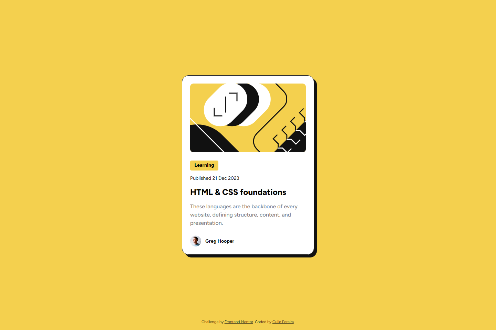
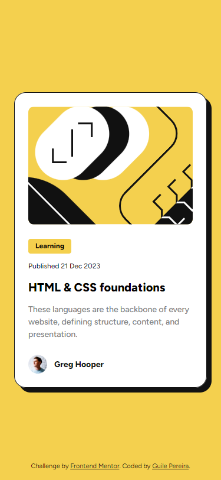

# Frontend Mentor - Blog preview card solution

This is a solution to the [Blog preview card challenge on Frontend Mentor](https://www.frontendmentor.io/challenges/blog-preview-card-ckPaj01IcS). Frontend Mentor challenges help you improve your coding skills by building realistic projects.

## Table of contents

- [Overview](#overview)
  - [The challenge](#the-challenge)
  - [Screenshot](#screenshot)
  - [Links](#links)
- [My process](#my-process)
  - [Built with](#built-with)
  - [Context](#context)
- [Author](#author)

## Overview

### The challenge

Users should be able to:

- See hover and focus states for all interactive elements on the page

### Screenshot

| Desktop    | Mobile |
| -------- | ------- |
|   |     |

### Links

[Live page](https://your-live-site-url.com)

[Solution on Frontend Mentor](https://your-solution-url.com)

## My process

### Built with

- Semantic HTML5 markup
- CSS custom properties
- Flexbox

## Context

Review and practice of HTML and CSS content.

## Author

- Website - [Guile Pereira](https://github.com/guilepereira)
- Frontend Mentor - [@guilepereira](https://www.frontendmentor.io/profile/guilepereira)